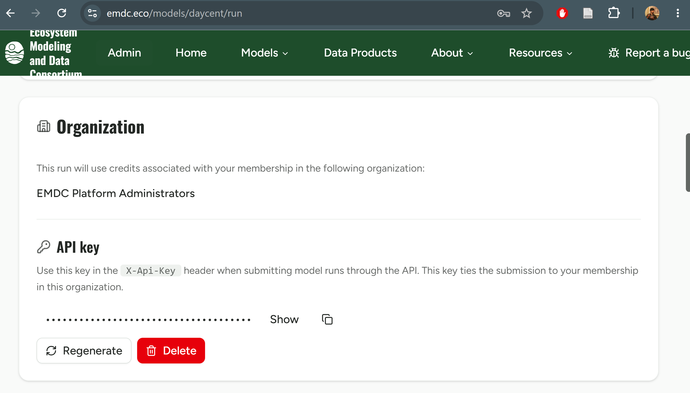

```{r setup-00, include=FALSE}
knitr::opts_chunk$set(eval = FALSE)
```

Do this once on your machine before either the 01 UI walkthrough or the 02
CLI/batch walkthrough.

## 1. Get an EMDC API key

Sign up at the EMDC.eco website and request DayCent researcher access.

Once approved, go to `emdc.eco/models/daycent/run`. Under **Organization**
you'll see which org's credits your runs will draw from; under **API key**,
click **Show** to reveal your key (or **Copy** to grab it directly). This is
the value used in the `X-Api-Key` header on every API request, and it's tied
to your membership in that organization.



Treat it like a password: it grants your account's credit-consuming access.

## 2. Store the key in `.Renviron`, not in scripts

R reads `~/.Renviron` at every session startup and turns each line into an
environment variable, without you ever typing the key into a script or the
command line. On Windows, confirm which directory R treats as `~`.

```{r find-renviron}
# Easiest: opens (or creates) .Renviron directly in your editor.
usethis::edit_r_environ()

# Or just confirm the path R actually reads, without opening it:
Sys.getenv("HOME")
file.path(path.expand("~"), ".Renviron")
```

In the file that opens, add:

```
EMDC_API_KEY=your-real-key-here
EMDC_BACKEND_SERVER=https://api.emdc.eco
```

**Check**

- `EMDC_BACKEND_SERVER` **must include the scheme** (`https://`). A bare
  `api.emdc.eco` silently gets 302-redirected by the server.
- Make sure the key itself is current. A stale/revoked key doesn't always
  fail loudly.

Save the file, then start a **fresh** R session (R only reads `.Renviron` at
startup) and verify:

```{r verify-renviron}
Sys.getenv("EMDC_API_KEY") != ""
Sys.getenv("EMDC_BACKEND_SERVER")
```

## 3. Get the DDcentutils API branch, then verify the key

The API backend lives on a feature branch, not `main`. Clone it and check
that branch out:

```powershell
git clone https://github.com/CSU-Soil-Carbon-Solution-Center/DDcentutils.git
cd DDcentutils
git checkout daycent-runner-backends
```

## 4. R package dependencies

The runner needs `httr`, `stringr`, `here`, and `usethis` (for the
`.Renviron` shortcut above), plus (for parallel/dev-mode work) `pkgload` and
`parallel`. If you're running from a source checkout rather
than an installed copy, dev-load the package each session rather than
`library(DDcentutils)`:

```{r pkgload-00}
pkgload::load_all(".", quiet = TRUE)
```

You're set up once you have the branch checked out, dependencies loaded, and
`.Renviron` configured with a working key.
