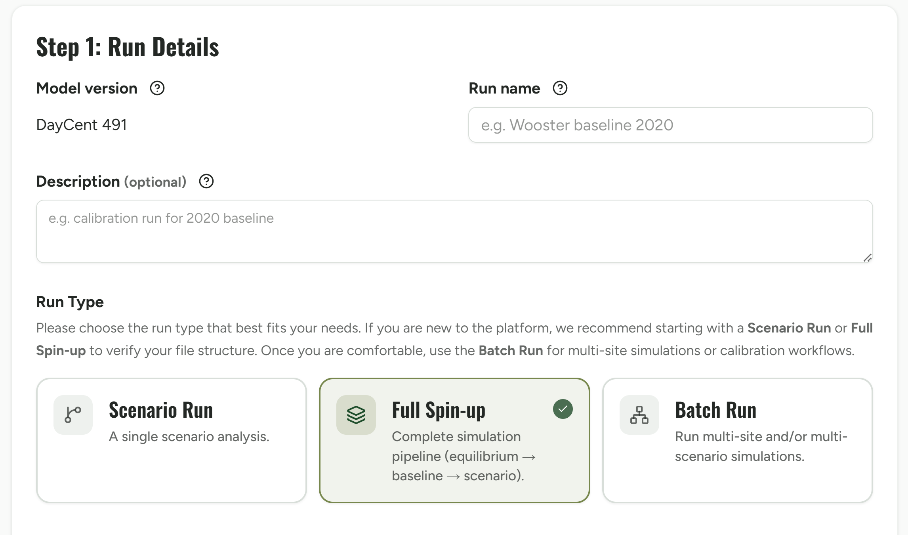
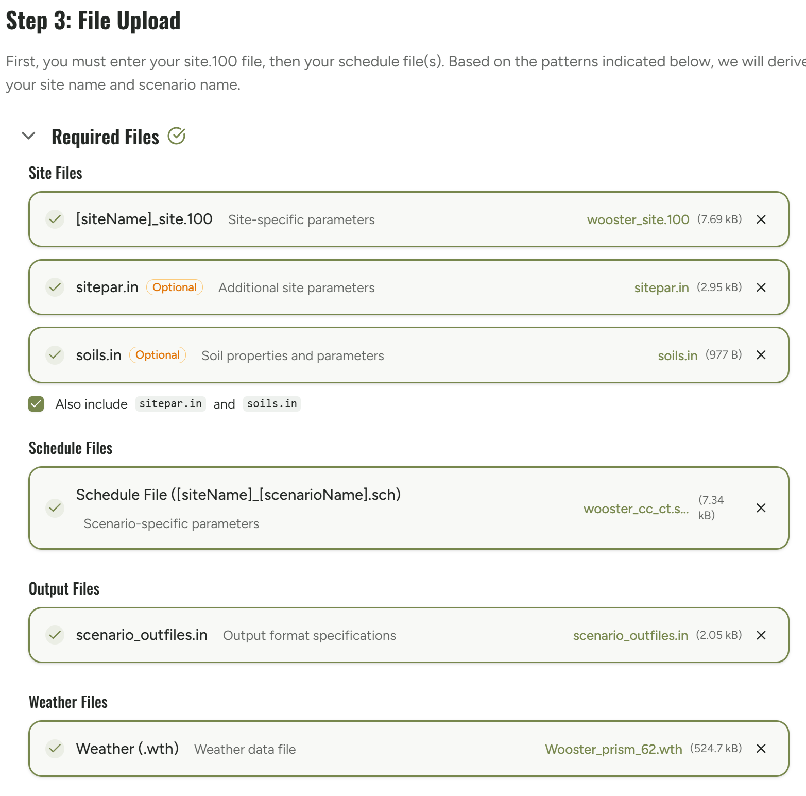
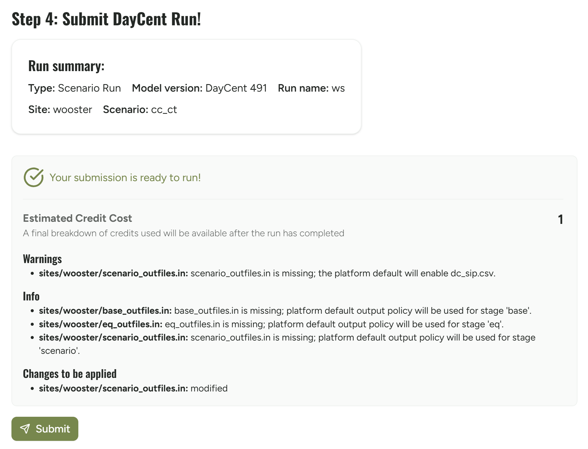
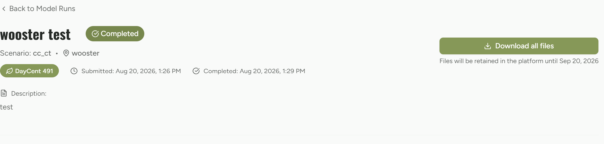

```{r setup-01, include=FALSE}
knitr::opts_chunk$set(eval = FALSE)
```

## Goal

Run one site/scenario pair — `wooster` / `cc_ct` — through the UI end to
end: upload inputs, preflight, submit, watch status, download results.

## Prerequisites

Completed `00-setup-api-key-and-environment.Rmd`: you're logged into the EMDC
UI with the same account whose API key you verified.

## Steps

1. **Prepare your input files.**
   The UI needs the same site files the API expects: `wooster_site.100`,
   `sitepar.in`, `soils.in`, the weather file(s) referenced by the schedule,
   `wooster_cb_ct.sch`, and `eq_outfiles.in` / `base_outfiles.in` /
   `scenario_outfiles.in` if you're running equilibrium. You can either zip
   the `sites/` folder at its top level, or upload the files individually —
   both are supported.

2. **Enter run details.**
   Set a descriptive, unique run name (e.g. `wooster-cc_ct-demo`) and an
   optional description. Model version (`DayCent 491`) is pre-filled — you
   should not need to supply a product ID directly, the platform resolves
   that internally from name+version. Choose the run type: **Scenario Run**
   for a single scenario like this walkthrough's `cc_ct`, **Full Spin-up**
   for the full equilibrium → baseline → scenario pipeline, or **Batch Run**
   for multi-site/multi-scenario runs.

   

3. **Upload your inputs.**
   Upload either the zipped `sites/` folder or the individual files from
   step 1 — the platform derives the site name and scenario name from the
   file naming pattern.

   

4. **Review preflight QC and submit.**
   Before the run starts, the review screen shows the platform's
   preflight/QC findings (this is the same server-side check the CLI's
   `--api-dry-run` flag exercises) plus the estimated credit cost. Confirm
   there are no blocking errors (warnings don't block; errors do) and the
   cost is acceptable, then click **Submit**.

   

5. **Watch status and download results.**
   Status progresses to `Completed` (or a terminal failure status — if so,
   stop and read the failure detail rather than resubmitting). Once
   complete, a **Download all files** button appears on the run detail page.
   Expect one output set per site/scenario: at minimum a `.bin`, a
   `_summary.out`, and `_dc_sip.csv` / harvest / year-summary files
   depending on your `outfiles.in` selection.

   

## Where this connects to the CLI

Everything above corresponds 1:1 to a `submit_daycent_run()` /
`runDayCent_api()` call with `dry_run = TRUE` then `dry_run = NULL` (step 4),
`wait = TRUE`, and `download_daycent_results()` (step 5). See
`02-batch-cli-r-script.Rmd` for the equivalent scripted version of this exact
same run.
